This is a small project to examine some seaweed farms using data from Planet Lab's Dove constellation of multispectral satellites.

# Layout
    `scene.py` a small library for working with planet scenes.
    `util.py` small self contained geo spatial utilities.
    `process.py` visualization code that makes use of the libraries
    `images/` images to embed in the readme
    `data/` not included in repo, contains large planet labs imagery files

The code is factored in a way so that all visualizations can be applied to any farm. The Scene classes factor out the differences between planet 4 and 8 band products so they can be used interchangeably.

Code quality note: this was written fairly quickly to balance code quality and results - docstrings, type annotations, comments and general code factoring could all still improve.

# Papers I found useful

- [1] [The Utility of Satellites and Autonomous Remote Sensing Platforms for Monitoring Offshore Aquaculture Farms: A Case Study for Canopy Forming Kelps](https://www.frontiersin.org/articles/10.3389/fmars.2020.520223/full)

- [2] [Economic and biophysical limits to seaweed farming for climate change mitigation](https://www.nature.com/articles/s41477-022-01305-9)

# Test Farms
- [aquafort](https://seagrant.unh.edu/blog/2021/12/aquafort-revolutionizing-local-aquaculture-new-hampshire-0):
    - location [43.06897 N, -70.7089] 
    - harvest date: June 6, 2023

- scott_lord_farm:
    - location [43.942709, -69.274238]    
    - harvest date: June 1, 2022

- chandler_cove_farm:
    - location [43.942709, -69.274238]    
    - harvest date: April 17, 2020

# Project
My goal was to get a intuitive and quantitative grasp on what can be learned about North American seaweed farms from planet labs 3-5 meter per pixel multi-spectral data.

I was provided with a datasheet of kelp mass for different Aquafort harvests, I did not pursue trying to align this data with the satellite imagery due to the small size of the Aquafort, I did not believe there was enough signal to do meaningful analysis. See the end for the [aquafort](#aquafort) analysis.

# Results

A quick look at an RGB frame of Scott's farm in photoshop (color corrected and sharpened) shows that the patch is decent sized for this imagery

The full planet frames are several km across and very large files.

(Note, this is not the planet official RBG product it is the 8 band multi-spectral product with the RGB bands extracted and colored corrected. This simple process is a lot quicker and gives you more control than downloading both products)

A good first step is to grab a quick bounding box of the region from geojson.io and use that to crop the images into something more workable.

## Timeseries

Now we can process all of the frames for our duration to see that the size of the patch evolves over time. It's especially visible in NDVI

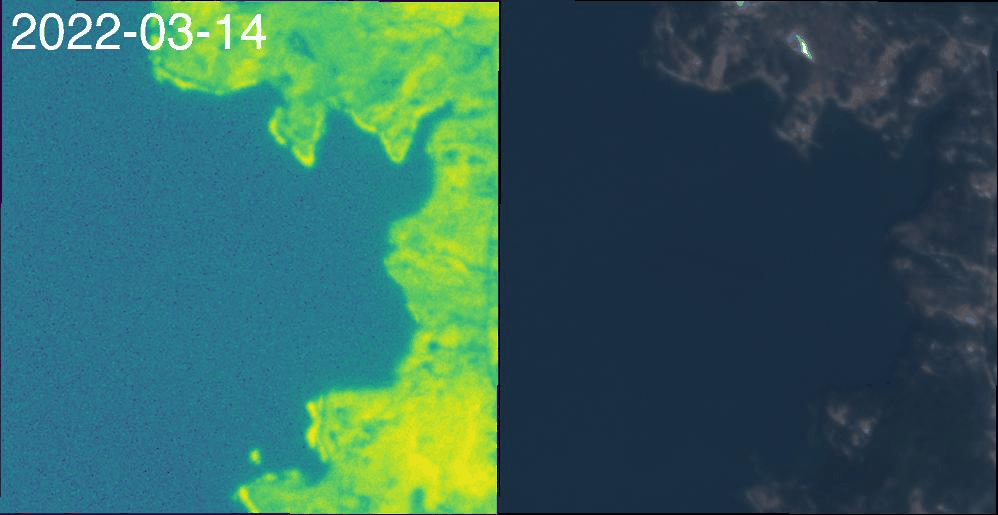

The progression here is hopeful for monitoring seaweed mass throughout its farm life-cycle.

## Spectral bands

Although the NDVI looks nice, I wanted to get an understanding of which spectral bands could best discriminate the seaweed from the water.

Several labs have measured kelp spectra 

To do this I took the brightest patch into photoshop and made a quick segmentation mask, white = seaweed, gray = surrounding ocean, black = ignore

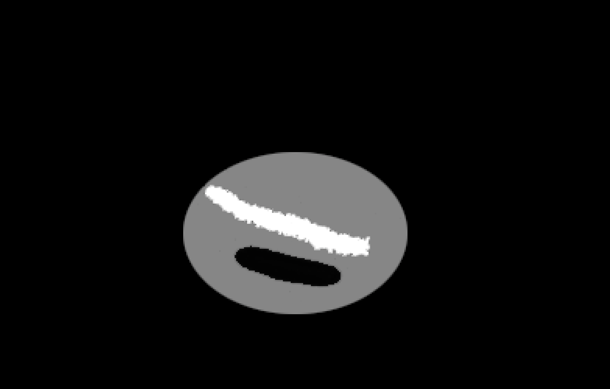

This would be a lot more interesting with automatic segmentation / density estimation but the hand mask will do for now. With it we can compute the signal-to-noise-ratio (SNR) of the object vs the surrounding water for each of the 8 planet spectral bands discrimination

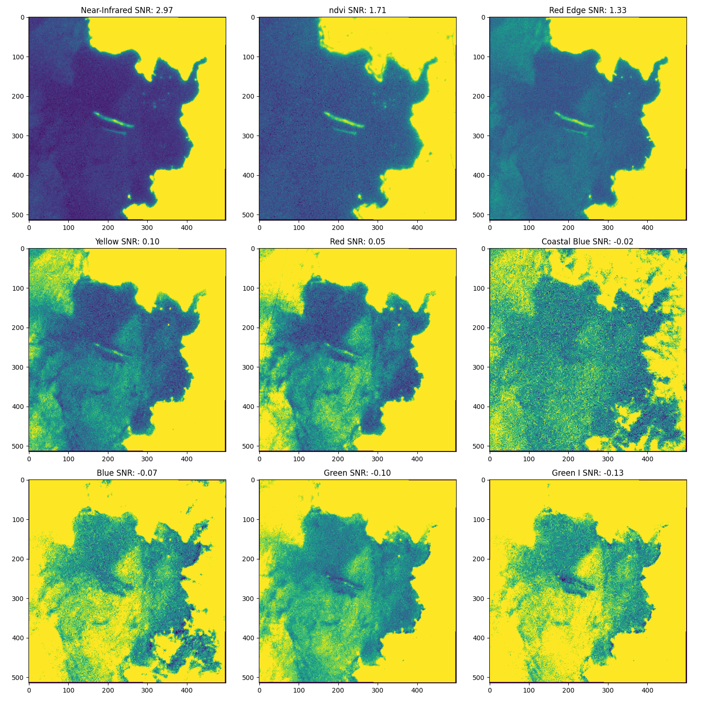

Unsurprisingly due to water's absorption of the NIR band, NIR has the highest SNR for our seaweed. Higher than NDVI even, though NDVI would more clearly separate green vegetation from other objects in the water.

Looking at the object/ocean mean values over wavelength we can see the ocean and seaweed don't start to discriminate until around 680nm.

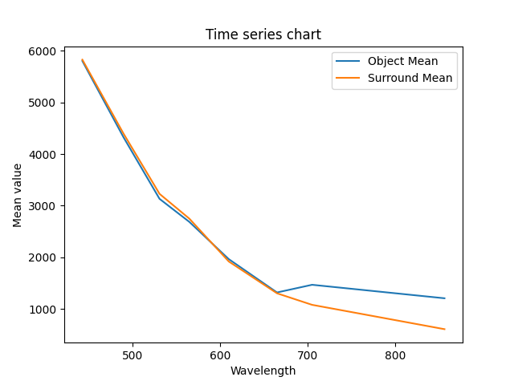

For reference lab tests of giant kelp show this reflectance spectrum [1]

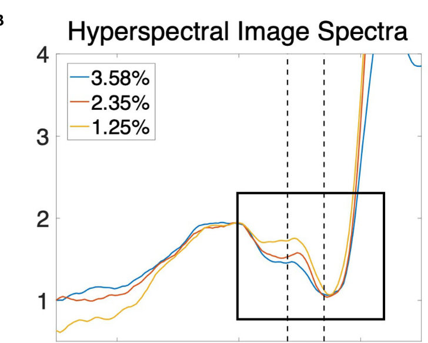

# Chandler Cove

Great cove name!

I did not do new analysis on this farm, however I was pleased that the code base was able to process the dataset without modification. This harvest dates to 2020 and therefore no 8 band captures exist, only 4 band. The scene.py code smooths over these differences to enable reusability in the visualization code.

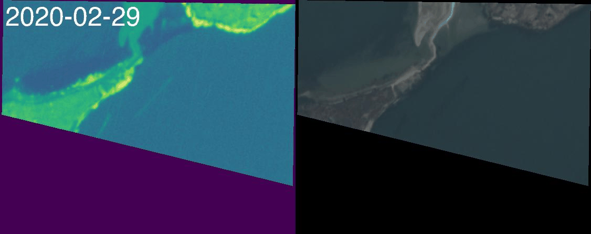

# Aquafort

The aquafort is a 20x50ft (6x15meter) platform for aquaculture, readily visible on google maps high res.

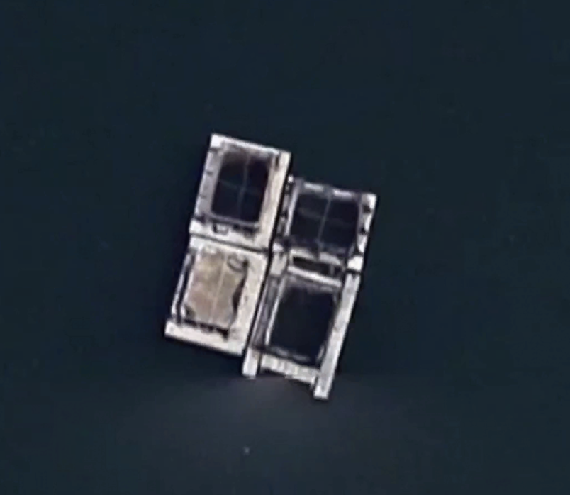

Planet labs imagery is sampled at 3 meters/pixel, even though its true geometric accuracy lies around 5 meters/pixel. This means the aquafort is sampled around 2x5 pixels on a good day.

It is very hard to make it out in visible or NDVI.

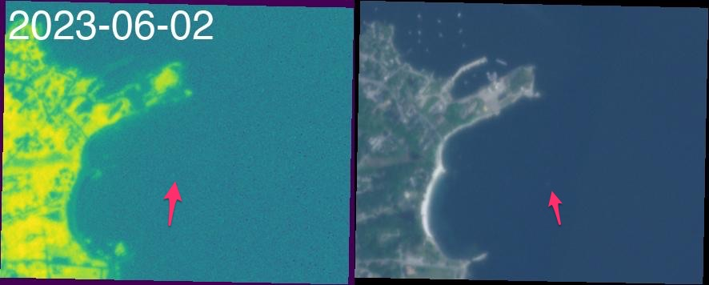

Aquafort was particularly visible in one frame, dated may 18th 2023. However an analysis of the per-band discrimination chart shows that it is visible in nearly every band. This could be explained by a specular reflection of sunlight off the object structure. It does not seem like any vegetative signal is present.

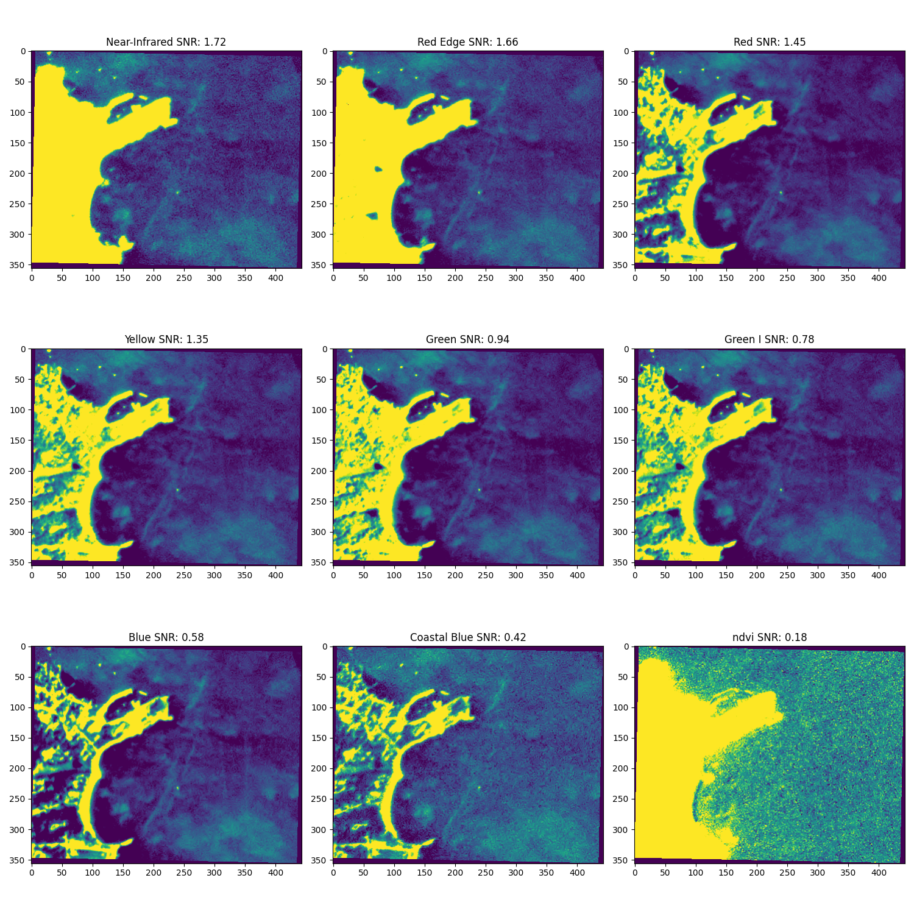

In order to get the best view possible of a small object, we can inspect a raw analytic frame and slightly sharpen it. Let's look at NIR

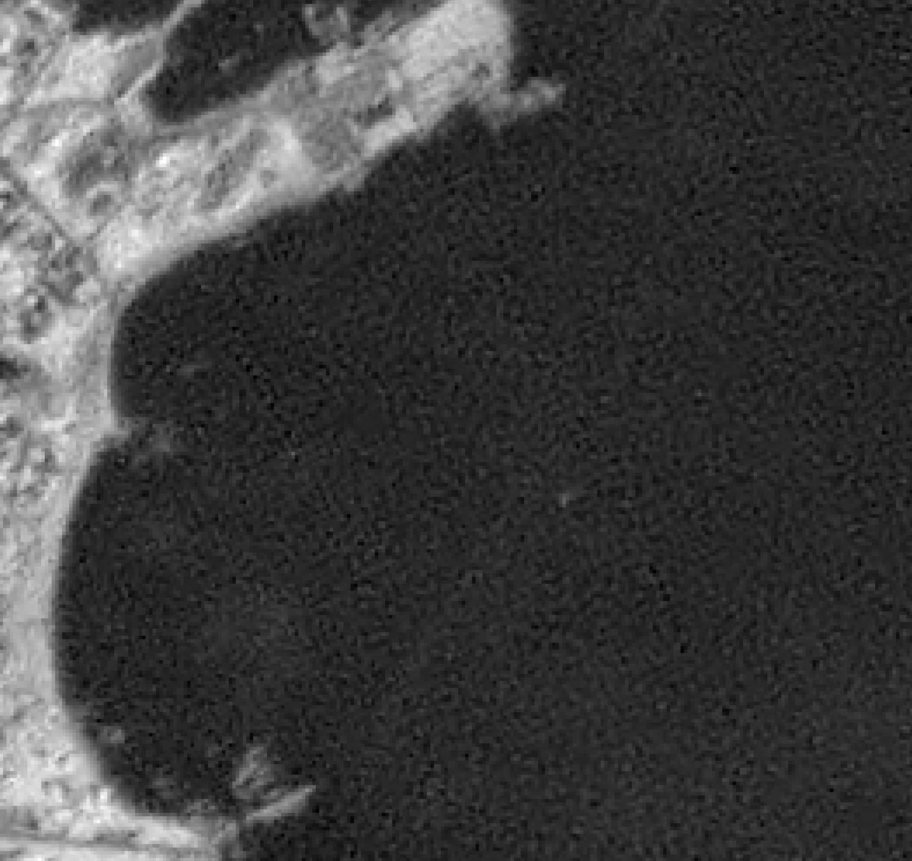

Beautiful

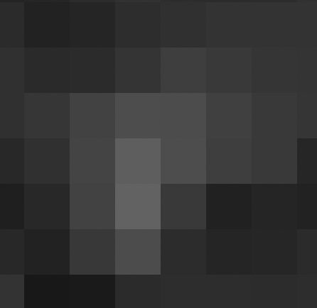

